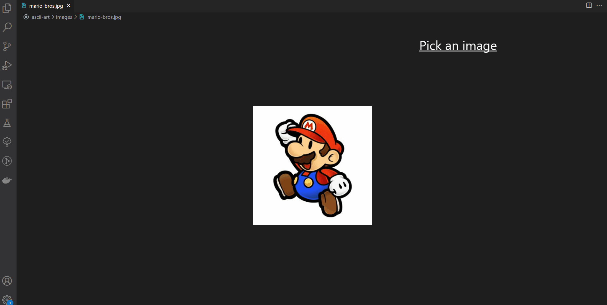

# ASCII Art

Turns images into ASCII art.

Implemented based on this [guide](https://robertheaton.com/2018/06/12/programming-projects-for-advanced-beginners-ascii-art/).

Tech stack used:
- NodeJS.
- Jest.
- Joi.

## Install

```bash
npm install
```

## Run



Show help:

```bash
node src/app.js -h
```

Print image with ASCII characters:

1. Write the following command but do not hit enter yet.

   ```bash
   node src/app.js --imagePath <path/to/the/image>
   ```

2. Zoom out as much as possible your terminal.
3. Hit enter.

The program assumes a screen resolution of 1920x1080. If the ASCII art looks squashed or weird
you can specify another screen resolution using the flag `--screenResolution <width>x<height>`:

```bash
node src/app.js --imagePath <path/to/the/image> --screenResolution 1280x720
```

## Examples

The cross of Christ:
<p align="center">
  
&nbsp; &nbsp; &nbsp;
  
</p>

Mario Bros:

<p align="center">
  
&nbsp; &nbsp; &nbsp;
  
</p>

Monkey:

<p align="center">
  
&nbsp; &nbsp; &nbsp;
  
</p>
